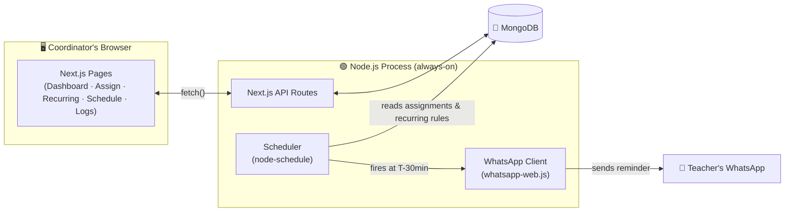
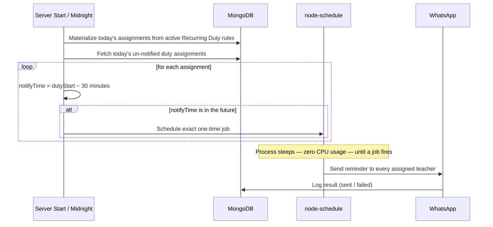

<div align="center">

# 🏫 Smart School Duty Management System

**Plan the teacher duty roster once — WhatsApp reminders send themselves.**

Built on Next.js 14. No separate backend. No manual reminders. No missed duties.

[](https://nextjs.org/)
[](https://www.typescriptlang.org/)
[](https://www.mongodb.com/atlas)
[](https://wwebjs.dev/)
[](https://tailwindcss.com/)

</div>

---

## 📖 Table of Contents

- [Why This Exists](#-why-this-exists)
- [Features](#-features)
- [Tech Stack](#-tech-stack)
- [Architecture](#️-architecture)
- [How the Smart Scheduler Works](#️-how-the-smart-scheduler-works)
- [Recurring Duties](#-recurring-duties)
- [Project Structure](#-project-structure)
- [Getting Started](#-getting-started)
- [One-Click Startup](#️-one-click-startup-for-non-technical-users)
- [Production Build](#-production-build-optional)
- [Environment Variables](#-environment-variables)
- [API Reference](#-api-reference)
- [Pages](#️-pages)
- [Deployment Notes](#️-deployment-notes)
- [Roadmap](#️-roadmap)
- [License](#-license)

---

## 🎯 Why This Exists

A school with ~50 teachers assigns dozens of daily duties every month — Assembly, Break, Gate, Corridor patrol, and more. Traditionally, someone has to **manually remind** every teacher before their duty starts. It's repetitive, easy to forget, and doesn't scale.

This system flips that: the coordinator sets the roster up **once** — either day-by-day for a specific month, or as a recurring weekly pattern — and every teacher gets a WhatsApp message **30 minutes before their duty**, automatically, forever, with zero ongoing manual effort.

---

## ✨ Features

| | Feature | Description |
|---|---|---|
| 🗓️ | **Monthly Roster Builder** | Assign teachers to duty types per day, for a specific month, in one place |
| 🔁 | **Recurring Weekly Duties** | Set a duty once for a weekday (e.g. every Monday) — it repeats forever, no re-assigning each month |
| ⏸️ | **Pause / Resume** | Temporarily pause a recurring duty without deleting it |
| 📋 | **Copy Week Pattern** | Copy week 1's duty pattern to every remaining week of a month in a click |
| 🔔 | **Automatic WhatsApp Reminders** | Fires exactly 30 minutes before each duty — no polling, no delay |
| 📊 | **Live Dashboard** | WhatsApp connection status, today's duties, monthly stats at a glance |
| 🎨 | **Color-Coded Schedule** | Read-only monthly view, color-coded by duty type, filterable by teacher |
| 🧾 | **Notification Log** | Full audit trail of every message sent — with delivery status |
| 🌗 | **Light & Dark Mode** | Polished UI that adapts to your preference |
| 📱 | **Fully Responsive** | Works cleanly on desktop, tablet, and mobile |
| 🔓 | **Zero Login Friction** | No accounts, no auth — built for trusted internal use |

---

## 🧱 Tech Stack

| Layer | Technology | Why |
|---|---|---|
| **Framework** | [Next.js 14](https://nextjs.org/) (App Router) | Frontend + API routes in one codebase — no separate backend server |
| **Language** | TypeScript | Type safety across models, API routes, and UI |
| **Database** | MongoDB + [Mongoose](https://mongoosejs.com/) | Flexible schema, easy local → cloud (Atlas) migration |
| **Messaging** | [whatsapp-web.js](https://wwebjs.dev/) | Free, no WhatsApp Business API approval needed |
| **Scheduling** | [node-schedule](https://github.com/node-schedule/node-schedule) | Precise one-time jobs instead of wasteful polling |
| **Styling** | Tailwind CSS | Fast, consistent, dark-mode-ready design system |

---

## 🏗️ Architecture



---

## ⏱️ How the Smart Scheduler Works

Most systems would poll the database every minute forever, wasting resources 99% of the time. This one doesn't.



| Step | What Happens |
|---|---|
| 1 | On server start **and every midnight**, `scheduleTodaysDuties()` runs |
| 2 | It first checks today's weekday against active **Recurring Duty** rules and auto-creates today's assignments from any that match |
| 3 | It then loads every duty assignment for **today** not yet notified |
| 4 | For each, it computes `notifyTime = dutyStartTime − 30 min` |
| 5 | If that time is still ahead, a precise one-time job is queued |
| 6 | When the job fires, WhatsApp messages go out and the result is logged |

> **Result:** the process is completely idle between jobs — no wasted CPU cycles, no missed reminders.

---

## 🔁 Recurring Duties

For duties that repeat every week (e.g. "Mr. Ismail always has Break Duty on Mondays"), you don't need to assign them month after month:

1. Go to **Recurring Duties** → pick a weekday, a duty type, and one or more teachers → **Add**.
2. Every day at midnight (and on server start), the scheduler checks whether today's weekday matches any active rule, and auto-creates that day's assignment if it doesn't already exist.
3. From there, the normal 30-minutes-before notification flow takes over automatically.
4. Use **Pause** to temporarily stop a rule from firing without deleting it, and **Resume** to bring it back.

This runs *alongside* the month-by-month **Assign Duties** page — use recurring rules for steady weekly patterns, and the monthly view for one-off or special-event duties.

---

## 📂 Project Structure

```
app/
├── api/                    → REST API routes (teachers, duty-types, assignments, recurring, logs, whatsapp)
├── page.tsx                → 📊 Dashboard
├── teachers/page.tsx       → 👩‍🏫 Teacher directory (CRUD)
├── duty-types/page.tsx     → 📋 Duty type definitions (CRUD)
├── recurring/page.tsx      → 🔁 Recurring weekly duties (CRUD, pause/resume)
├── assign/page.tsx         → 🗓️ Monthly duty assignment builder
├── schedule/page.tsx       → 👁️ Read-only monthly schedule view
└── logs/page.tsx           → 🧾 Notification history

lib/
├── db.ts                   → MongoDB connection singleton
├── whatsapp.ts             → WhatsApp Web client singleton
└── scheduler.ts            → Smart notification scheduling logic + recurring-duty materialization

models/
└── Teacher.ts · DutyType.ts · DutyAssignment.ts · RecurringDuty.ts · NotificationLog.ts

components/
└── Navbar.tsx · Logo.tsx · ThemeToggle.tsx · ConfirmDialog.tsx

instrumentation.ts          → Boots the WhatsApp client + scheduler once, on server start
```

---

## 🚀 Getting Started

### Prerequisites

| Requirement | Notes |
|---|---|
| [Node.js](https://nodejs.org/) | LTS version recommended |
| MongoDB | Local install **or** free [MongoDB Atlas](https://www.mongodb.com/cloud/atlas) cluster |
| Google Chrome / Edge | Required by `whatsapp-web.js` for headless WhatsApp Web automation |

### Installation

```bash
# 1. Install dependencies
npm install

# 2. Create your environment file (see below)

# 3. Run the app
npm run dev
```

Open **[http://localhost:3000](http://localhost:3000)** — that's it.

### Connect WhatsApp

1. On first run, a **QR code prints directly in the terminal**.
2. Open WhatsApp on your phone → **Linked Devices** → **Link a Device** → scan it.
3. The session is saved locally in `.wwebjs_auth/` — you won't need to scan again on future restarts.

---

## 🖱️ One-Click Startup (for non-technical users)

A ready-made **`Start-School-Duty-System.bat`** script is included:

```
Double-click  →  Server starts in background  →  Browser opens automatically
```

To make it foolproof for whoever runs the system day-to-day:

1. Right-click the `.bat` file → **Send to → Desktop (create shortcut)**
2. Rename the shortcut to something friendly, e.g. **"School Duty System"**
3. Hand it over — that's the only button they'll ever need to press

---

## 📦 Production Build (optional)

| Mode | Command | Best For |
|---|---|---|
| **Development** | `npm run dev` | Quick local testing, live reload |
| **Production** | `npm run build && npm start` | Long-running, unattended deployments — faster, more stable |

---

## 🔑 Environment Variables

Create a `.env.local` file in the project root:

| Variable | Required | Example | Description |
|---|:---:|---|---|
| `MONGODB_URI` | ✅ | `mongodb://localhost:27017/school-duty-system` | MongoDB connection string (local or Atlas) |
| `CHROME_PATH` | ❌ | `C:\Program Files\Google\Chrome\Application\chrome.exe` | Only needed if Chrome/Edge isn't in a default install location |

> 💡 **Atlas tip:** if your network blocks `mongodb+srv://` DNS lookups (`querySrv ECONNREFUSED`), use Atlas's standard (non-SRV) connection string instead — it lists direct shard hostnames and skips that DNS record type entirely.

---

## 🔌 API Reference

| Route | Methods | Description |
|---|---|---|
| `/api/teachers` | `GET` `POST` | List / create teachers |
| `/api/teachers/[id]` | `PUT` `DELETE` | Update / delete a teacher |
| `/api/duty-types` | `GET` `POST` | List / create duty types |
| `/api/duty-types/[id]` | `PUT` `DELETE` | Update / delete a duty type |
| `/api/recurring` | `GET` `POST` | List / create recurring weekly duty rules |
| `/api/recurring/[id]` | `PUT` `DELETE` | Update (incl. pause/resume) / delete a recurring rule |
| `/api/assignments` | `GET` `POST` `DELETE` | List / create / remove duty assignments |
| `/api/assignments/bulk` | `POST` | Bulk-create assignments (e.g. copy a week's pattern) |
| `/api/whatsapp/status` | `GET` | Current WhatsApp connection status |
| `/api/whatsapp/test` | `POST` | Send a one-off test message — `{ "phone": "923001234567", "message": "..." }` |
| `/api/logs` | `GET` | Notification history |
| `/api/dashboard` | `GET` | Aggregated stats for the dashboard |

---

## 🖥️ Pages

| Route | Purpose |
|---|---|
| `/` | 📊 Dashboard — WhatsApp status, stats, today's duties |
| `/teachers` | 👩‍🏫 Manage the teacher directory |
| `/duty-types` | 📋 Manage duty types (name, location, start time) |
| `/recurring` | 🔁 Set up weekly recurring duties, pause/resume, or remove them |
| `/assign` | 🗓️ Assign duties per day for a chosen month |
| `/schedule` | 👁️ Read-only monthly view, color-coded, filterable by teacher |
| `/logs` | 🧾 Notification send history |

---

## ⚠️ Deployment Notes

This project needs a **persistent, always-running process** (to keep the WhatsApp session and scheduled jobs alive) plus **headless Chrome**. That rules out a few popular options:

| Platform | Works? | Why |
|---|:---:|---|
| Vercel / Netlify | ❌ | Serverless — functions spin down between requests, killing the WhatsApp session & scheduled jobs |
| Shared / cPanel hosting | ❌ | No root access, no persistent process, no headless Chrome |
| **VPS** (DigitalOcean, Hostinger, Contabo, Hetzner) | ✅ | Full SSH/root access, process runs 24/7 |
| **Dedicated always-on PC** (e.g. school office/lab PC) | ✅ | Use the one-click `.bat` script above |

---

## 🗺️ Roadmap

- [ ] Multi-school (SaaS) support with per-school login and data isolation
- [ ] Migrate to WhatsApp Business API for multi-tenant scale
- [ ] Subscription/billing for a hosted SaaS offering
- [ ] Teacher self-service portal (view own upcoming duties)

---

## 📄 License

Internal/private project — no license specified.

<div align="center">

Made with ❤️ for schools tired of manually chasing down teachers before every duty.

</div>
